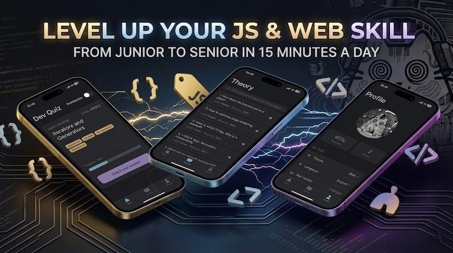

# JS Interviewer: Master Your Frontend Technical Interviews


<p align="center">
  
</p>

<!--
```text
      ██╗███████╗    ██╗███╗   ██╗████████╗███████╗██████╗ ██╗   ██╗██╗███████╗██╗    ██╗███████╗██████╗
      ██║██╔════╝    ██║████╗  ██║╚══██╔══╝██╔════╝██╔══██╗██║   ██║██║██╔════╝██║    ██║██╔════╝██╔══██╗
      ██║███████╗    ██║██╔██╗ ██║   ██║   █████╗  ██████╔╝██║   ██║██║█████╗  ██║ █╗ ██║█████╗  ██████╔╝
      ██║╚════██║    ██║██║╚██╗██║   ██║   ██╔══╝  ██╔══██╗╚██╗ ██╔╝██║██╔══╝  ██║███╗██║██╔══╝  ██╔══██╗
  ██████║███████║    ██║██║ ╚████║   ██║   ███████╗██║  ██║ ╚████╔╝ ██║███████╗╚███╔███╔╝███████╗██║  ██║
  ╚═════╝╚══════╝    ╚═╝╚═╝  ╚═══╝   ╚═╝   ╚══════╝╚═╝  ╚═╝  ╚═══╝  ╚═╝╚══════╝ ╚══╝╚══╝ ╚══════╝╚═╝  ╚═╝

The interview preparation tool for frontend engineers mastering JavaScript, Typescript, browser internals etc.
```
-->

<br>

<p>
  If you found these materials helpful for your interview or just useful in general, please star this repo 🌟. Your support is my best motivation!
</p>


[](https://github.com/hardsoncore/js-interviewer)


## 📖 Why JS Interviewer?

JS Interviewer is a powerful mobile application designed to turn your interview preparation into a structured and efficient process. Whether you are a Junior starting your journey or a Senior refreshing your knowledge, this app covers everything from core JavaScript to complex Browser Mechanics.
<br>
Preparing for interviews is often chaotic. This project solves that by organizing the most critical "must-know" topics in one place. It’s not just a list of questions; it’s a comprehensive tool to track your progress and identify your weak spots before the recruiter does.

## 🛠 Key Features
 - Comprehensive Question Bank: Hundreds of curated questions on JavaScript, CSS, and Web Technologies.

 - Deep Dive into Browser Mechanics: Understand how engines work, the Event Loop, rendering phases, and optimization.

 - Progress Tracking: Visual indicators to show which topics you have mastered and what needs more focus.


## 🚀 Live Demo

The project is deployed and available online - start practicing:
<br>

<div align="center">
  <a href="https://hardsoncore.github.io/js-interviewer">
    
  </a>
</div>

## 📌 Project Status & Architecture

The primary goal of this project — **delivering high-quality, up-to-date interview questions and answers** — remains the focus. The core UI framework (Angular/Ionic) is currently frozen.

I am actively maintaining and expanding the *content* of this repository. The code might be a bit older, but the knowledge base is fresh, actively updated, and growing!

## 📱 Add app to your mobile (Android / iOS)

For quick and easy access, you can save the application directly to your smartphone's home screen.

* **For iOS (iPhone / iPad):**
  1. Open the link in the **Safari** browser.
  2. Tap the **Share** icon at the bottom of the screen.
  3. Scroll down and select **Add to Home Screen**.

* **For Android:**
  1. Open the link in the **Chrome** browser.
  2. Tap the menu icon (three dots in the top right corner).
  3. Select **Add to Home screen**.

## 🚀 Getting Started

### Prerequisites

- [Node.js](https://nodejs.org/) (v18 or higher)

### Installation

1. Clone the repository:
```bash
git clone https://github.com/hardsoncore/js-interviewer.git
cd js-interviewer
```

2. Install dependencies:
```bash
npm install
```

3. Start the development server:
```bash
npm run start
```

## 📂 Project Structure

```
js-interviewer/
├── src/
│   ├── app/              # Application components and modules
│   ├── assets/           # Static assets (images, icons, questions and answers etc.)
│   ├── environments/     # Environment configurations
│   └── theme/            # Global styles and themes
```

## 👤 Author

**Yehor Niestierov**

- GitHub: [@hardsoncore](https://github.com/hardsoncore)

## 📄 License

This project is open source and available under the [MIT License](LICENSE).

---

<p align="center">
  Made with ❤️ for the developer community
</p>

<p align="center">
  <em>Good luck with your interviews! 🚀</em>
</p>
