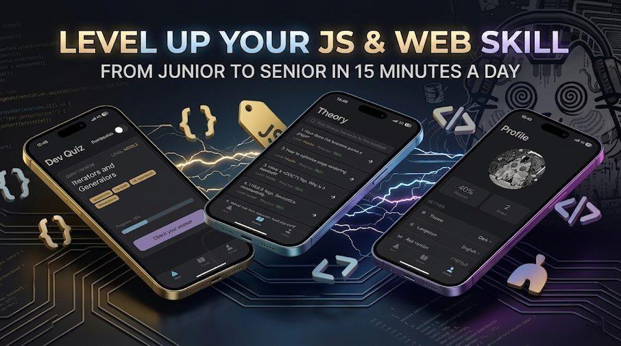

# JS Interviewer

**Prepare for frontend interviews the way you'll actually be tested: a confident 1–2 minute spoken answer first, senior-level depth on demand.**


<p align="center">
  
</p>

<div align="center">
  <a href="https://hardsoncore.github.io/js-interviewer">
    
  </a>
  <br>
  <em>No install, no sign-up — open and start practicing.</em>
</div>

## 😩 The problem

You have an interview coming up and a list of 150+ possible questions. Most prep guides respond to that with walls of text and hope you'll memorize everything. You won't — and you don't need to. An interview is an oral exam: you get 60–90 seconds to give a clear, structured answer before the follow-ups begin.

## 💡 The solution: Pareto-driven answers

JS Interviewer applies the **Pareto principle — ~20% of the material gives ~80% of the interview result.** Every answer has two layers:

- **The Core** — what you say out loud in 1–2 minutes: definition, key idea, minimal code example, classic pitfalls. This is what interviewers expect to hear first, and it's small enough to review on your phone in a queue.
- **Deep Dive** — the remaining 20%: under-the-hood mechanics, edge cases, and senior-level details for when the interviewer starts digging.

Your whole prep in three passes:

1. First pass — read the Cores.
2. Second pass — unfold the Deep Dives.
3. Night before the interview — skim the Cores again. Done.

> The knowledge base is actively being migrated to this two-layer format, answer by answer.

## 🛠 What's inside

- **170+ curated questions** on JavaScript, TypeScript, CSS, browser internals, Angular, and RxJS.
- **Three languages** — answers available in English, Ukrainian, and Russian.
- **Progress tracking** — see which topics you've mastered and where to focus next.
- **Works on your phone** — installable as a home-screen app, perfect for commute-sized study sessions.

<details>
<summary><b>📱 How to add it to your home screen</b></summary>
<br>

**iOS (Safari):** open the [app link](https://hardsoncore.github.io/js-interviewer) → tap **Share** → **Add to Home Screen**.

**Android (Chrome):** open the [app link](https://hardsoncore.github.io/js-interviewer) → tap **⋮** menu → **Add to Home screen**.

</details>

## 🚀 Run locally

Requires [Node.js](https://nodejs.org/) v18+.

```bash
git clone https://github.com/hardsoncore/js-interviewer.git
cd js-interviewer
npm install
npm run start
```

## 🤝 Project status & contributing

The focus of this project is **high-quality, up-to-date interview content**. The UI framework (Angular/Ionic) is frozen — the code may be a bit older, but the knowledge base is fresh and growing.

Content PRs are welcome: questions and answers live in `src/assets/content/` (per-language `questions.ts` + Markdown answers).

## ⭐ Support

If these materials helped you land an interview — or just taught you something — please star the repo. It's the best motivation to keep the content growing!

[](https://github.com/hardsoncore/js-interviewer)

## 👤 Author

**Yehor Niestierov** — [@hardsoncore](https://github.com/hardsoncore)

Licensed under the [MIT License](LICENSE).

---

<p align="center">
  Made with ❤️ for the developer community — good luck with your interviews! 🚀
</p>
